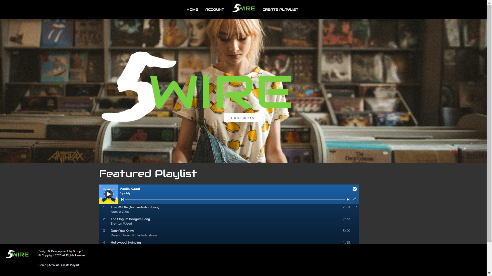

# FiveWire Music App

## Introduction

* Users need to create playlists for different occasions, whether for workouts, parties, or relaxation.

## Problem Statement:
* As a user, I want to create and save personalized playlists. I also want to join a live music queue, and see trending tracks other users are listening to. 

## Description
An app that uses the Spotify API, npm packages sequelize and express, MYSQL database, Animate.Css, and UIKit.

FiveWire allows users to:
* create an account
* see a featured playlist with trending songs
* search for songs
* add and delete songs on a playlist
* create and delete playlists
* join other users in the "jukebox" room with a live music queue 
* add songs to the music queue
* when in the jukebox room, users can play and pause the current song

 
## screenshot of application: 

## link to deployed application:
https://group5-proj2.herokuapp.com/
